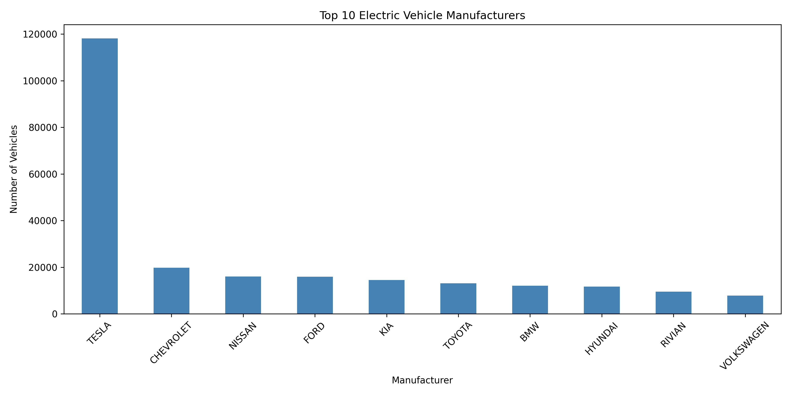
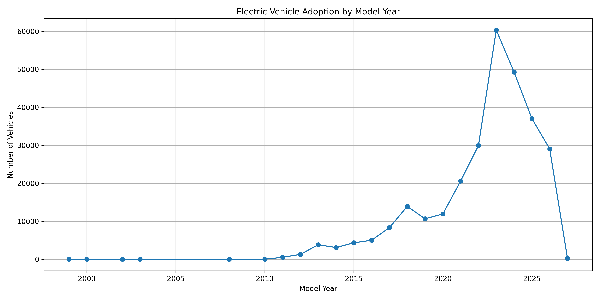
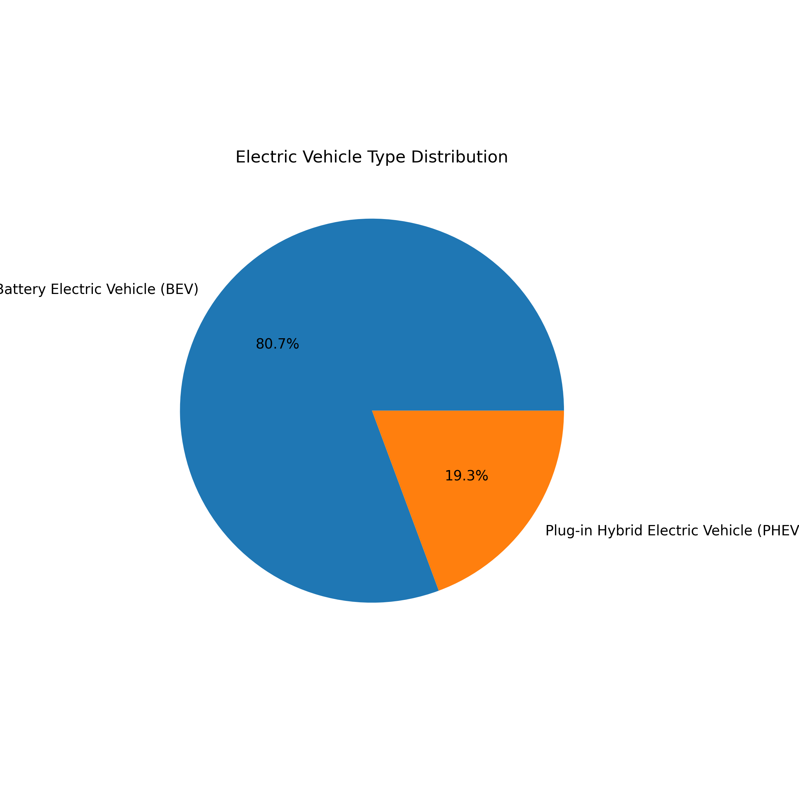
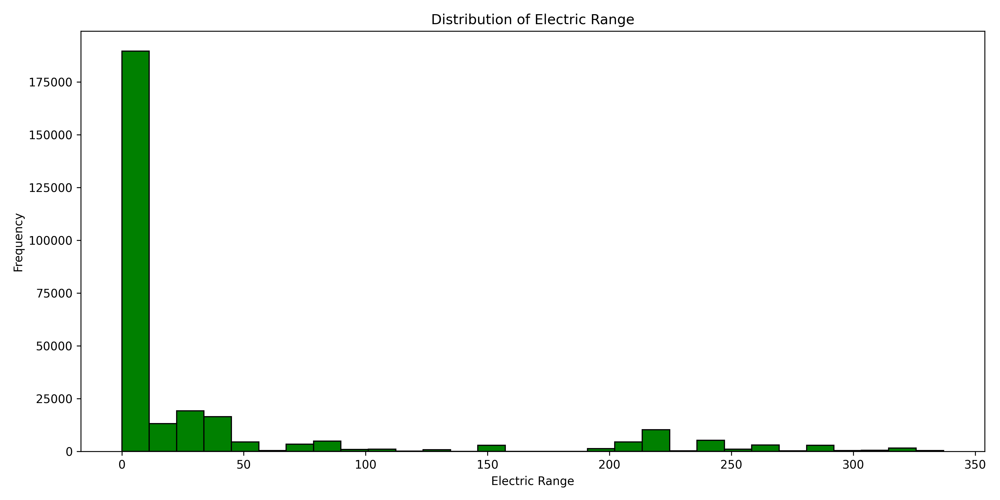
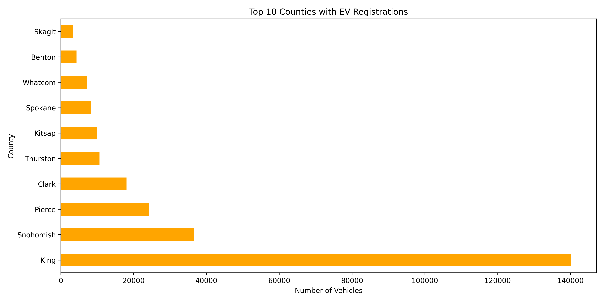
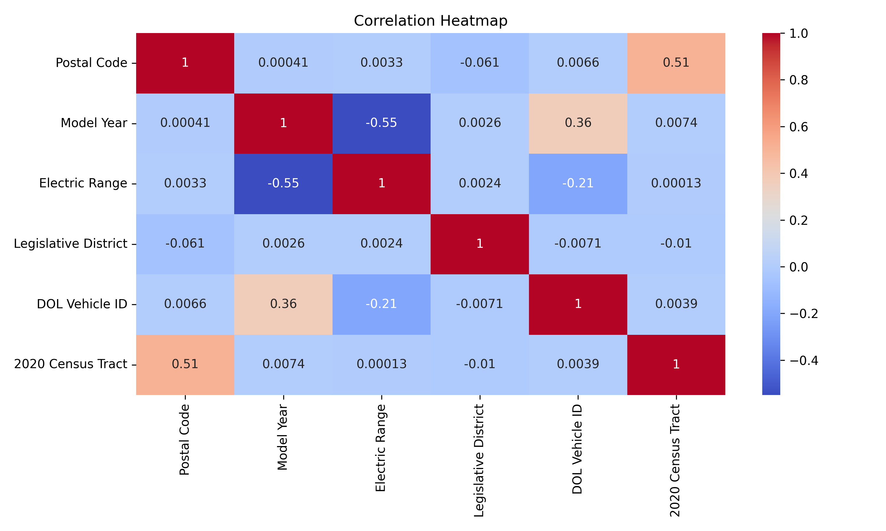
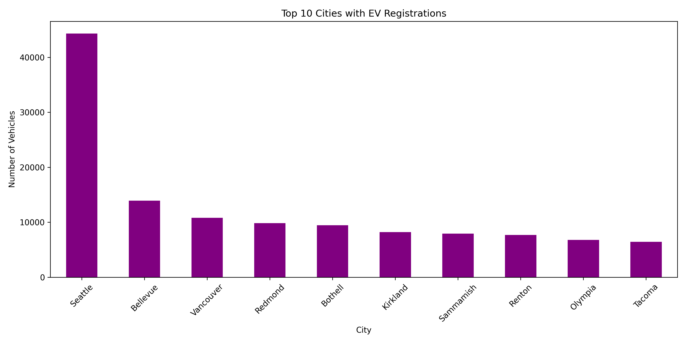

# 🚗 Electric Vehicle Data Analysis

## 📌 Project Overview

This project analyzes the Washington State Electric Vehicle (EV) Population dataset using Python. The analysis includes data cleaning, exploratory data analysis (EDA), data visualization, and a Linear Regression model to understand EV adoption trends and predict electric vehicle range.

---

## 🎯 Objectives

- Clean and preprocess the EV dataset.
- Handle missing values and duplicate records.
- Perform Exploratory Data Analysis (EDA).
- Visualize EV trends using charts and maps.
- Build a Linear Regression model to predict Electric Range.
- Export the cleaned dataset for further analysis.

---

## 🛠️ Technologies Used

- Python
- Pandas
- NumPy
- Matplotlib
- Seaborn
- Scikit-learn
- Folium
- Jupyter Notebook

---

## 📂 Project Structure

```
EV-Data-Analysis/
│
├── EV_Analysis_Anusha.ipynb      # Jupyter Notebook
├── EV_Analysis_Anusha.docx       # Project Report
├── EV_Cleaned_Data.csv           # Cleaned Dataset
├── export.csv                    # Original Dataset
├── Visualizations/
│   ├── 01_Top_Manufacturers.png
│   ├── 02_Model_Year.png
│   ├── 03_EV_Type.png
│   ├── 04_Electric_Range.png
│   ├── 05_Top_Counties.png
│   ├── 06_Heatmap.png
│   ├── 07_Top_Cities.png
│   └── 08_EV_Map.html
└── README.md
```

---

## 📊 Data Cleaning

- Checked for missing values.
- Removed duplicate records.
- Cleaned Electric Range values.
- Standardized categorical data.
- Verified data quality before analysis.

---

## 📈 Exploratory Data Analysis

The analysis includes:

- Top EV manufacturers
- Top EV models
- EV registrations by county
- EV registrations by city
- Model year trends
- Electric range statistics
- CAFV eligibility analysis

---

## 📊 Project Visualizations

### 1. Top 10 EV Manufacturers



---

### 2. EV Adoption by Model Year



---

### 3. Electric Vehicle Type Distribution



---

### 4. Electric Range Distribution



---

### 5. Top 10 Counties by EV Registrations



---

### 6. Correlation Heatmap



---

### 7. Top 10 Cities by EV Registrations



---

### 8. Interactive EV Location Map

GitHub cannot display an interactive HTML map directly inside a README.

Open the interactive map here:

[📍 EV Registration Map](Visualizations/08_EV_Map.html)

## 🤖 Machine Learning

A **Linear Regression** model was developed to predict **Electric Range**.

### Steps

- Data preprocessing
- Feature selection
- Train-test split
- Model training
- Prediction
- Model evaluation

### Evaluation Metrics

- Mean Squared Error (MSE)
- R² Score

---

## 📌 Key Insights

- Identified the most common EV manufacturers and models.
- Analyzed EV adoption trends across model years.
- Compared electric range among different vehicle types.
- Explored regional EV distribution.
- Built a predictive model for electric range.

---

## ▶️ How to Run

1. Clone the repository.

```bash
git clone https://github.com/AnushaValishetty2024/EV-Data-Analysis.git
```

2. Open the project folder.

3. Install the required libraries.

```bash
pip install pandas numpy matplotlib seaborn scikit-learn folium openpyxl notebook
```

4. Launch Jupyter Notebook.

```bash
jupyter notebook
```

5. Open:

```
EV_Analysis_Anusha.ipynb
```

6. Run all cells.

---

## 📁 Dataset

**Washington State Electric Vehicle Population Dataset**

The dataset contains information about:

- Vehicle Make
- Model
- Model Year
- Electric Vehicle Type
- Electric Range
- County
- City
- CAFV Eligibility
- Vehicle Location
- Electric Utility

---

## 👩‍💻 Author

**Anusha Valishetty**

- GitHub: https://github.com/AnushaValishetty2024
- LinkedIn: https://www.linkedin.com/in/anushavalishetty/

---

## 📜 License

This project is developed for educational and learning purposes as part of a Data Analytics assignment.
